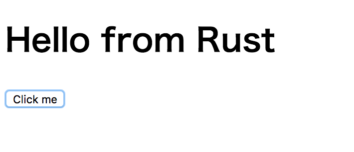

# rust-wasm-dom
Simple demo that manipulate DOM in WebAssembly / Rust

## How it works
rust-webplatform (https://github.com/tcr/rust-webplatform) enables us to manipulate DOM in Rust. For more infomation, read that document.

## Build the project
Run `cargo build --target wasm32-unknown-emscripten`. After that, you will see `target/wasm32-unknown-emscripten/debug/deps/rust_wasm_dom-*********.wasm` and `target/wasm32-unknown-emscripten/debug/rust-wasm-dom.js`. You might need to fix index.html to correct the path. Then, run `python -m SimpleHTTPServer` and see `http://localhost:8000/` in your browser.
